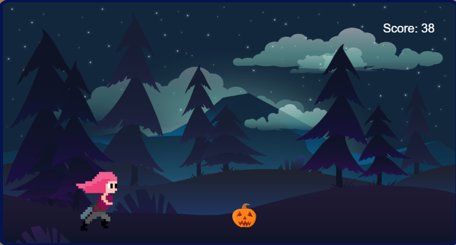

<h1>The Halloween Night</h1>

The Halloween Night is a game built in HTML, CSS, canvas and JavaScript.

Click HERE to play!

For better experience, run this game in a browser on you nootebook or desktop PC. Unfortunatelly this game is not compatible with mobile, yet.

<h2>Installation</h2>

<ul>
<li>Clone or download this project</li>
<li>Open the index.html file in your browser</li>
<li>Enjoy!</li>
</ul>

<h2>About the game</h2>

The Halloween Night is an Endless Runner 2D style game.

Help the warrior survive by jumping over obstacles!

<h2>How to Play</h2>

<ul>
<li>Press START and then your adventure will begin.</li>
<li>Use the "W" key to jump over the obstacles.</li>
<li>You have double jump!</li>
<li>When you die to restart: press START BUTTON again.</li>
<li>Good luck and have fun!</li>
</ul>

<h2>Contribution</h2>

This is a free software, feel free to contribute in any way you want

<ol>
<li>Fork it</li>
<li>Create your feature branch (git checkout -b feature/fooBar)</li>
<li>Commit your changes (git commit -am 'Add some fooBar')</li>
<li>Push to the branch (git push origin feature/fooBar)</li>
<li>Create a new Pull Request</li>
</ol>
